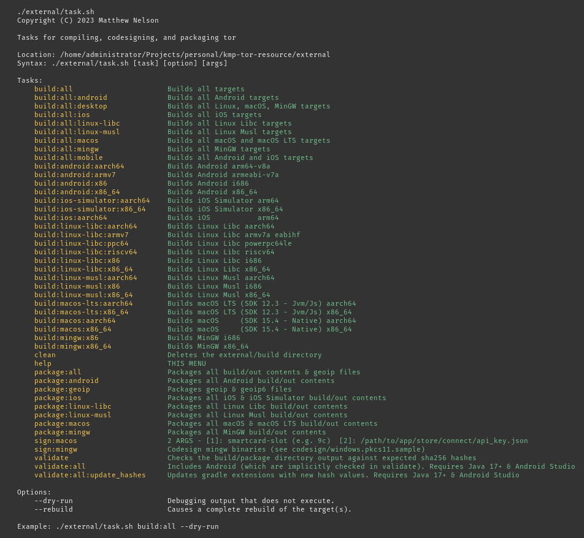

# COMPILATION DETAILS

<!-- TODO -->

`tor` is compiled via the `external/task.sh` script using `Docker` in order to maintain
reproducibility.

Detached code signatures are generated for Apple/Windows builds which are checked into
`git`; this is so others wishing to verify reproducibility of the compiled output they
are running (or providing to their users) can do so.

You can view the `help` output of `task.sh` by running `./external/task.sh` from the project's
root directory.

```
$ git clone https://github.com/05nelsonm/kmp-tor-resource.git
$ cd kmp-tor-resource
$ ./external/task.sh
```

<details>
    <summary>Task Help Menu</summary>



</details>

### Packaging

The compiled output from `task.sh`'s `build` tasks are "packaged" for the given platforms and
moved to their designated package module's resource directories
(e.g. `external/build/package/resource-lib-tor/src/jvmMain/resources`).

Running `./external/task.sh package:all` after a `build` task will do the following.

**Android/Jvm/Node.js:**
- Android compilations are moved to the `src/androidMain/jniLibs/{ABI}` directory.
- `geoip` & `geoip6` files are `gzipped` and moved to the `src/jvmMain/resources` directory.
- Detached code signatures for `macOS` and `Windows` are applied to the compilations (if needed).
- All compilations are `gzipped` and moved to the `src/jvmMain/resources` directory for their respective
  hosts and architectures.

**Native:**
- The same process occurs as above, but after being `gzipped` each resource is transformed into
  a `NativeResource` (e.g. `resource_tor_gz.kt`).

After "packaging" all resources, an additional step for Node.js is performed.
- `geoip`, `geoip6`, and all compilations are published to `Npmjs` via the `:library:npmjs` module.
    - See https://www.npmjs.com/search?q=kmp-tor.resource-exec
