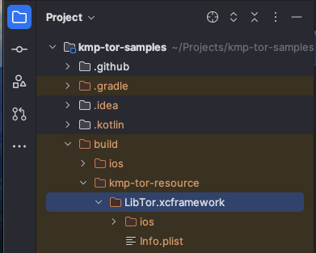
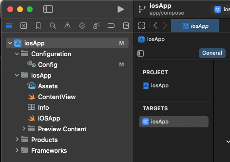
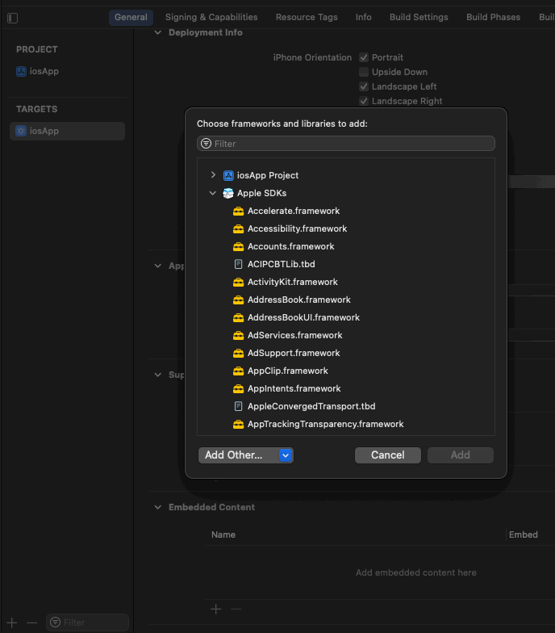
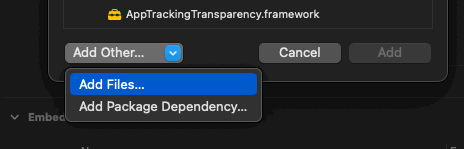
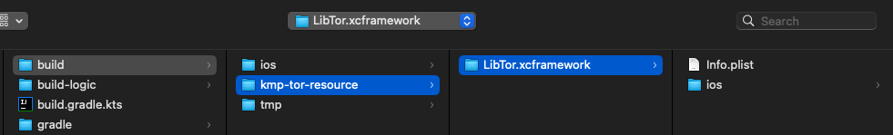
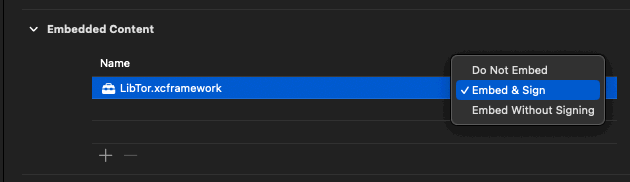
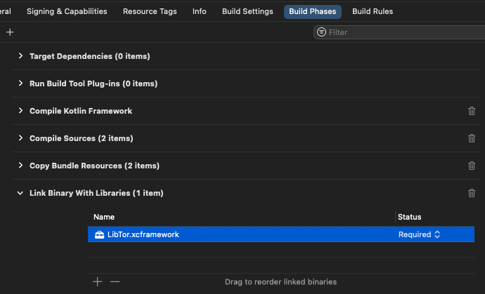
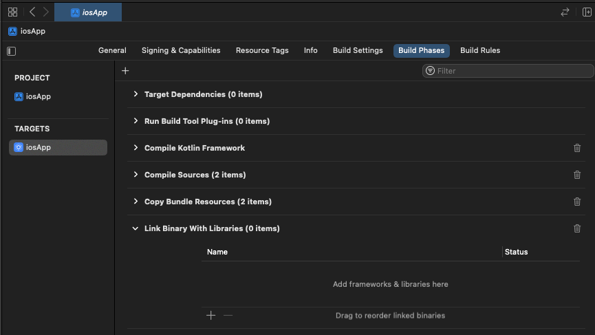

# resource-frameworks-gradle-plugin

This plugin is for the sole purpose of delivering Apple Framework(s) to a project 
such that they can be included in the final Xcode project. Unfortunately, there 
is no way around it; the final code signatures must match that of the application's 
in order to load `tor`.

### Usage

<!-- TAG_VERSION -->

- Add the plugin to your **root project's** `build.gradle(.kts)` file 
  ```kotlin
  plugins {
    id("io.matthewnelson.kmp.tor.resource-frameworks") version("408.16.2")
  }
  ```

- If you are utilizing the `-gpl` resource variants, configure the extension as such 
  ```kotlin
  kmpTorResourceFrameworks {
    torGPL.set(true)
  }
  ```

- Re-sync your project; framework(s) should now be located in the root project's `build/kmp-tor-resource` directory  
  

- Add `LibTor.xcframework` to your `Xcode` project:
    - Open up your project in `Xcode`:  
      
    - Under the `General` tab -> `Embedded Content`, click the `+` sign to add a framework:  
      
    - Select the `Add Other...` dropdown -> `Add Files...`:  
      
    - Select `build/kmp-tor-resource/LibTor.xcframework` and click `Open`:  
      
    - Ensure that `Embed & Sign` is selected:  
      
    - Under the `Build Phases` tab -> `Link Binary With Libraries`, click the `-` sign to remove the framework:  
       
        - **NOTE:** This step **cannot** be skipped, as `LibTor` is compiled with linker flag `-no_uuid` 
          such that linking it with the application fails. `kmp-tor:resource-noexec-tor` only needs the 
          signed framework present and handles all loading/unloading. 
    - Things should look like the following now:  
      
      
- That's it. When you update the plugin version, it will automatically update the framework(s).  
